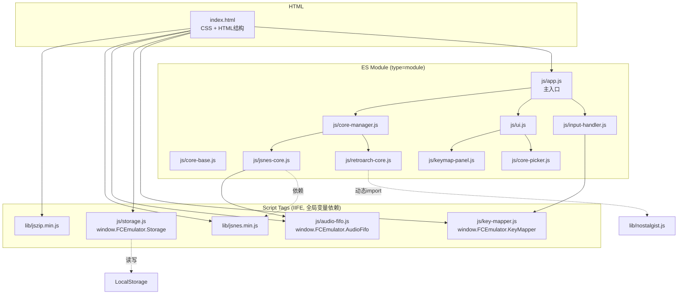

## 用户需求

将 FC 红白机模拟器 `modules/fc-emulator/index.html` 中的 ~1390 行代码进行抽象化、类化、模块化重构，用现代 JavaScript 编程规范重新组织。

## 当前问题

1. **全局状态污染**：~20 个全局变量散落各处（activeCore, isRunning, currentScale, turboMode, frameCount, lastTime, lag, audioFifoHead 等）
2. **职责混杂**：UI 渲染、业务逻辑、输入处理、存储管理、音频处理全部混在一起
3. **重复代码**：`startGameWithROM` 和 `loadWithCore` 中大量重复的 UI 切换逻辑（约 20 行完全重复）
4. **HTML 内联事件**：按钮全部使用 `onclick="xxx()"` 内联调用全局函数
5. **DOM 查询无缓存**：频繁调用 `document.getElementById()` 且不缓存结果
6. **触摸事件逻辑分散**：摇杆和按钮的触摸处理散落在不同位置

## 项目约束

- GitHub Pages 静态站点，**无构建工具**（不能使用 webpack/vite/ESM bundler）
- `jsnes.min.js` 和 `jszip.min.js` 是 UMD 全局变量，只能通过 `<script>` 标签加载
- `nostalgist.js` 通过动态 `import()` 加载（ESM）
- 必须保持单文件或少量文件的最终产物（静态 HTML + 少量 JS 模块文件）

## 目标结构

将单文件拆分为按职责划分的 JS 模块文件，通过 `<script>` 标签或 ES module 引入，实现清晰的模块边界和类封装。

## 技术方案

### 模块化策略：IIFE + Script 标签 + ES Module 混合

由于项目运行在无构建工具的 GitHub Pages 上，采用以下策略：

- **公共基础模块**（AudioFifo、Storage、KeyMapper）：使用 IIFE 封装到 `window.FCEmulator.*` 命名空间，通过 `<script>` 标签加载
- **核心类**（JsnesCore、RetroArchCore）：ES module 文件，通过 `<script type="module">` 加载
- **主应用**（App）：ES module 入口文件，引用所有模块

### 文件拆分方案

```
modules/fc-emulator/
  index.html          # HTML 结构 + CSS 样式
  js/
    audio-fifo.js      # [NEW] AudioFifo 环形缓冲区类
    storage.js         # [NEW] Storage 持久化管理
    key-mapper.js      # [NEW] 按键映射管理
    input-handler.js   # [NEW] 键盘/触摸输入处理（含虚拟摇杆）
    core-base.js       # [NEW] 核心基类/接口定义
    jsnes-core.js      # [NEW] JsnesCore 类
    retroarch-core.js  # [NEW] RetroArchCore 类
    core-manager.js    # [NEW] 核心管理器（自动检测、创建、切换）
    ui.js              # [NEW] UI 管理器（加载层、工具栏、缩放、全屏）
    keymap-panel.js    # [NEW] 按键设置面板
    core-picker.js     # [NEW] 核心选择器/切换器 UI
    app.js             # [NEW] 主应用入口，初始化和事件绑定
```

### 架构设计



### 核心类设计

**1. AudioFifo - 音频环形缓冲区**

- 将全局 `audioFifoL/R, audioFifoHead/Count` 封装为独立类
- 提供 `write(l, r)`, `read()` 方法，内部管理指针
- 线程安全设计（单线程无需锁，但接口清晰）

**2. Storage - 持久化管理**

- 封装所有 localStorage 操作
- 管理 ROM 数据、游戏状态、核心偏好的存取
- 处理 QuotaExceededError

**3. KeyMapper - 按键映射**

- 管理游戏按键映射和连发按键映射
- 提供 `codeToBtn(code)`, `codeToLabel(code)` 等查询方法
- 管理连发按键状态（turboKeyHeld）

**4. InputHandler - 输入处理**

- 封装键盘事件监听
- 封装虚拟摇杆逻辑（JoystickController）
- 封装触摸按钮逻辑（TouchButtonHandler）
- 统一的 `onButtonDown(btn)` / `onButtonUp(btn)` 回调接口

**5. CoreManager - 核心管理**

- 封装 `createCoreInstance`, `tryAutoLoad`, `loadWithCore`, `startGameWithROM`
- 消除重复的 UI 切换逻辑（提取 `activateCore(core, romData, romName)` 方法）
- 管理核心偏好和自动检测

**6. UI - UI 管理**

- DOM 元素缓存（$ 属性或 Map）
- Loading overlay 控制
- 缩放/全屏管理
- Canvas 显示切换

**7. KeymapPanel / CorePicker - UI 组件**

- 各自管理自己的 DOM 渲染和事件

### 消除重复代码的具体方案

当前 `startGameWithROM` 和 `loadWithCore` 中有重复的激活核心逻辑：

```
activeCore = core;
switchCanvasDisplay(core);
updateCoreIndicator(core);
currentROMData = romData;
currentROMName = romName;
updateScale();
hideLoading();
core.start();
```

提取为 `CoreManager.activateCore(coreDef, core, romData, romName)` 统一方法。

### 全局变量消除方案

- 使用 IIFE namespace (`window.FCEmulator`) 挂载基础模块
- ES module 间通过 import/export 传递依赖
- App 类持有顶层状态引用，各模块通过构造函数注入依赖

### 加载顺序

```html
<!-- 全局依赖 -->
<script src="lib/jszip.min.js"></script>
<script src="lib/jsnes.min.js"></script>
<!-- IIFE 基础模块 -->
<script src="js/audio-fifo.js"></script>
<script src="js/storage.js"></script>
<script src="js/key-mapper.js"></script>
<!-- ES Module 主应用 -->
<script type="module" src="js/app.js"></script>
```

### 实现注意事项

- `jsnes.NES` 和 `JSZip` 是全局变量，在 ES module 中通过 `window.jsnes` / `window.JSZip` 访问
- `nostalgist.js` 保持动态 `import()` 加载方式不变
- HTML 中的 `onclick` 全部替换为 JS 中的 `addEventListener`，消除全局函数依赖
- CSS 保持内联在 index.html 的 `<style>` 中，不单独拆分（减少 HTTP 请求）
- DOM 元素引用在 UI 类初始化时一次性缓存，避免重复查询