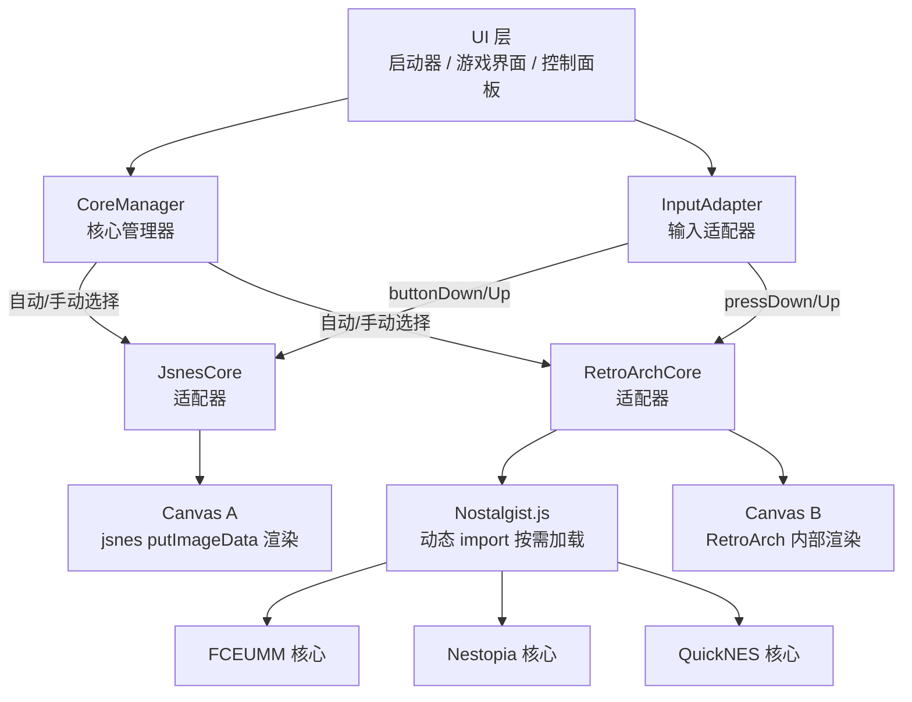
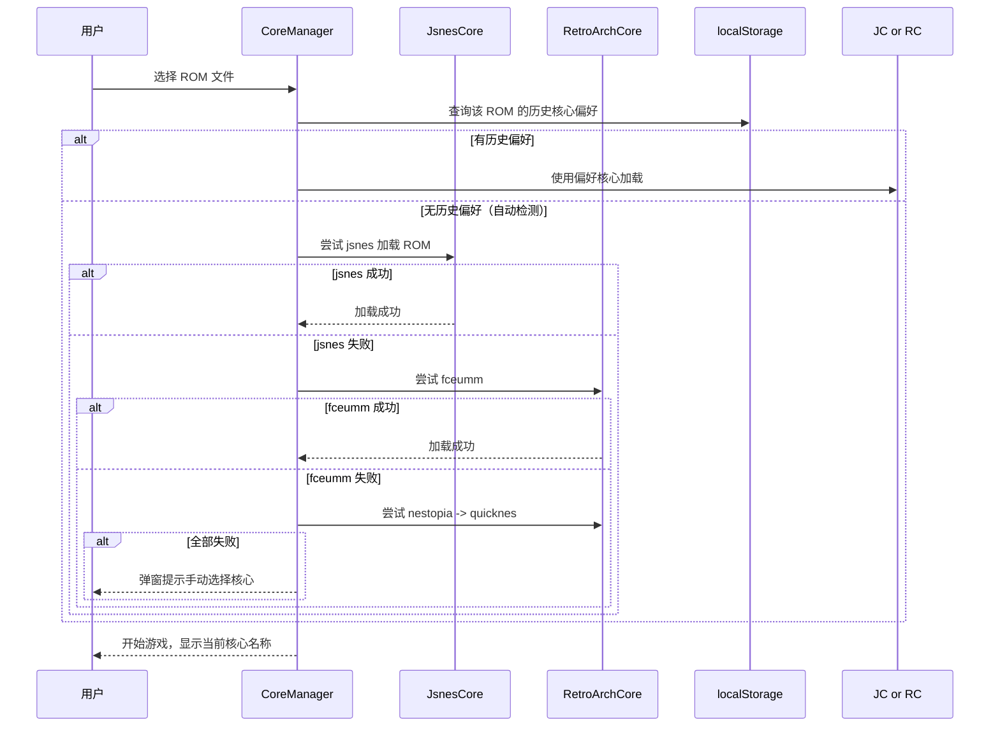

## 产品概述

重做 FC 红白机模拟器，在保留现有 jsnes 核心作为默认引擎的基础上，集成 Nostalgist.js + RetroArch 多核心支持（fceumm、nestopia、quicknes），以增强游戏 ROM 兼容性，覆盖各种改版、破解、修改过的非官方 ROM。

## 核心功能

- **多核心架构**：保留 jsnes（快速启动），新增 fceumm（最佳兼容性）、nestopia（高精度）、quicknes（高速）三个 RetroArch 核心，共 4 个核心可选
- **自动核心选择**：加载 ROM 时按优先级自动尝试（jsnes -> fceumm -> nestopia -> quicknes），首个能正常运行的核心即被采用；若自动检测全部失败，弹窗提示用户手动选择
- **手动核心选择**：启动器界面提供核心选择控件；游戏界面显示当前核心名称并提供切换按钮；用户手动选择的核心偏好会按 ROM 名称记忆到 localStorage
- **离线使用**：所有核心文件（Nostalgist.js 库 + RetroArch WASM 核心包）全部下载到 lib/ 目录本地托管，无需联网即可切换核心
- **功能完整保留**：虚拟摇杆、自定义按键映射、连发键（可调频率）、画面缩放（0.5x-5x）、全屏（含横屏锁定）、ZIP ROM 解压、游戏状态存档/恢复（localStorage 持久化）等全部现有功能适配多核心
- **存档兼容**：存档数据中记录创建时使用的核心类型，恢复时自动匹配核心

## 技术栈

- **前端框架**：无框架，原生 JavaScript + HTML + CSS（延续现有单文件应用模式）
- **核心引擎**：jsnes（现有） + Nostalgist.js（新增，用于加载 RetroArch 核心）
- **RetroArch 核心**：fceumm_libretro、nestopia_libretro、quicknes_libretro（来源：retroarch-emscripten-build 仓库）
- **构建工具**：无（纯静态文件部署于 GitHub Pages）

## 实现方案

### 核心架构：适配器模式 + 双画布系统

采用**适配器模式**统一 jsnes 和 Nostalgist.js 完全不同的 API，上层 UI 代码只依赖统一接口，不感知底层核心差异。

**关键架构决策：**

1. **双画布策略**：jsnes 使用自有 Canvas + putImageData 手动渲染 + 自管理游戏循环；Nostalgist.js/RetroArch 内部创建并管理自己的 Canvas 和游戏循环。两者无法共享画布。方案：两个 Canvas 放在同一容器内，根据活跃核心显示/隐藏，共享缩放和全屏 CSS。

2. **输入适配**：jsnes 使用数字索引（A=0, B=1, SELECT=2, START=3, UP=4, DOWN=5, LEFT=6, RIGHT=7）；Nostalgist.js 使用字符串名（'a', 'b', 'select', 'start', 'up', 'down', 'left', 'right'）。通过输入适配层统一转换。

3. **游戏循环分离**：jsnes 模式下由我们的 `requestAnimationFrame` 循环驱动；RetroArch 模式下 Nostalgist.js 内部管理循环，我们只需在初始化后调用 `nostalgist.start()` 即可。

4. **Nostalgist.js 导入策略**：Nostalgist.js 是 ES Module 包。采用**动态 import()** 方式按需加载——仅在用户选择 RetroArch 核心时才加载 Nostalgist.js 库和对应核心文件，避免影响 jsnes 的快速启动体验。

5. **自动检测逻辑**：尝试加载 ROM 时捕获异常/错误，若当前核心失败则按优先级尝试下一个；同时在 jsnes 模式下运行若干帧后检测帧缓冲是否有有效像素（非全黑），若无则判定失败切换核心。

6. **RetroArch 核心文件加载**：通过 Nostalgist.js 的 `core: { name, js, wasm }` 对象传入本地相对路径（如 `lib/fceumm_libretro.js`），Nostalgist.js 内部负责 fetch 和初始化。

### 架构设计



### 数据流：ROM 加载 + 自动核心选择



### 目录结构

```
modules/fc-emulator/
├── index.html                    # [MODIFY] 完整重写：核心抽象层、核心选择UI、双画布系统、多核心适配
└── lib/
    ├── jsnes.min.js              # [EXISTING] JSNES 核心引擎（保留不动）
    ├── jszip.min.js              # [EXISTING] ZIP 解压库（保留不动）
    ├── nostalgist.min.js         # [NEW] Nostalgist.js 库（从 npm 下载，ES Module 格式）
    ├── fceumm_libretro.js        # [NEW] FCEUMM RetroArch 核心脚本（从 retroarch-emscripten-build 下载解压）
    ├── fceumm_libretro.wasm      # [NEW] FCEUMM RetroArch 核心二进制
    ├── nestopia_libretro.js      # [NEW] Nestopia RetroArch 核心脚本
    ├── nestopia_libretro.wasm    # [NEW] Nestopia RetroArch 核心二进制
    ├── quicknes_libretro.js      # [NEW] QuickNES RetroArch 核心脚本
    └── quicknes_libretro.wasm    # [NEW] QuickNES RetroArch 核心二进制
```

### index.html 修改要点

index.html 是单文件应用（当前 1152 行），重写后预计 1800-2200 行，主要变更：

1. **核心抽象层**（约 200 行）：

- `class JsnesCore`：封装现有 jsnes 的 `new jsnes.NES()`、`loadROM()`、`frame()`、`buttonDown/Up()`、`saveState/loadState()`，管理自有 Canvas 渲染和 Web Audio 环形缓冲区
- `class RetroArchCore`：封装 Nostalgist.js 的 `Nostalgist.launch()`、`pressDown/Up()`、`saveState/loadState()`、`getCanvas()`、`exit()`，动态 import Nostalgist.js 和核心文件
- 统一接口：`loadROM(data)`、`start()`、`stop()`、`buttonDown(port, btnName)`、`buttonUp(port, btnName)`、`saveState()`、`loadState(state)`、`getCanvas()`、`getName()`

2. **CoreManager**（约 100 行）：

- 核心注册表：4 个核心的 id、名称、描述、优先级
- `tryAutoLoad(romData, romName)`：按优先级依次尝试加载
- `loadWithCore(coreId, romData, romName)`：指定核心加载
- `switchCore(coreId)`：运行中切换核心（需重新加载 ROM）
- ROM 核心偏好存储：`localStorage` key `fc_core_pref_{romName}`

3. **双画布管理**（约 30 行）：

- 新增 `<div id="canvas-container">` 包裹两个 Canvas
- jsnes Canvas（`#screen`）保留，新增 RetroArch Canvas 容器
- 根据活跃核心切换 `display`，共享 `transform: scale()` 和全屏 CSS

4. **核心选择 UI**（约 80 行 HTML + CSS + JS）：

- 启动器界面：核心选择区域（单选按钮组 + 简要描述）
- 游戏界面：顶部核心名称标签 + 切换按钮（点击弹出核心选择面板）
- 自动检测失败弹窗：列出所有可用核心供用户选择

5. **输入适配**（约 40 行修改）：

- 所有调用 `nes.buttonDown(1, btnToIndex(btn))` 改为 `activeCore.buttonDown(1, btn)`
- 所有调用 `nes.buttonUp(1, btnToIndex(btn))` 改为 `activeCore.buttonUp(1, btn)`
- 虚拟摇杆、触摸按钮、键盘映射逻辑保持不变，仅输出端从直调 jsnes 改为调用 activeCore

6. **存档适配**（约 30 行修改）：

- 存档数据结构增加 `coreId` 字段
- 恢复时匹配核心类型，不匹配则提示用户

7. **Nostalgist.js 按需加载**（约 50 行）：

- `loadNostalgistLib()`：动态 `import('./lib/nostalgist.min.js')` 并缓存
- 加载失败时回退提示

### 关键代码结构

**统一核心接口（概念定义，非最终代码）：**

```
EmulatorCore:
  id: string              // 'jsnes' | 'fceumm' | 'nestopia' | 'quicknes'
  name: string            // 显示名称
  description: string     // 核心描述
  
  async loadROM(romData: string|ArrayBuffer, romName: string): Promise<void>
  start(): void
  stop(): Promise<void>
  buttonDown(port: number, btn: string): void   // btn: 'A'|'B'|'SELECT'|'START'|'UP'|'DOWN'|'LEFT'|'RIGHT'
  buttonUp(port: number, btn: string): void
  saveState(): any
  loadState(state: any): void
  getCanvas(): HTMLCanvasElement | null
```

**RetroArch 核心配置（概念定义）：**

```
RETROARCH_CORES = [
  { id: 'fceumm',   name: 'FCEUMM',  jsPath: 'lib/fceumm_libretro.js',   wasmPath: 'lib/fceumm_libretro.wasm' },
  { id: 'nestopia', name: 'Nestopia', jsPath: 'lib/nestopia_libretro.js', wasmPath: 'lib/nestopia_libretro.wasm' },
  { id: 'quicknes', name: 'QuickNES', jsPath: 'lib/quicknes_libretro.js', wasmPath: 'lib/quicknes_libretro.wasm' },
]
```

### 性能与可靠性

- **jsnes 零延迟启动**：jsnes 及其依赖已内联加载，选择 jsnes 核心时无需额外网络请求，保持现有的快速启动体验
- **RetroArch 按需加载**：Nostalgist.js 库（约 50-100KB）仅在首次选择 RetroArch 核心时通过动态 import 加载，之后缓存在内存中；WASM 核心文件（各约 1-3MB）仅在启动时加载一次
- **帧率控制**：jsnes 模式维持现有固定 60FPS + 帧追赶限制（最多 3 帧）；RetroArch 模式由 Nostalgist.js 内部管理帧率
- **向后兼容**：存档格式增加 `coreId` 字段但保持向后兼容（旧存档默认视为 jsnes）
- **优雅降级**：若浏览器不支持 WebAssembly 或动态 import，自动隐藏 RetroArch 核心选项，仅显示 jsnes